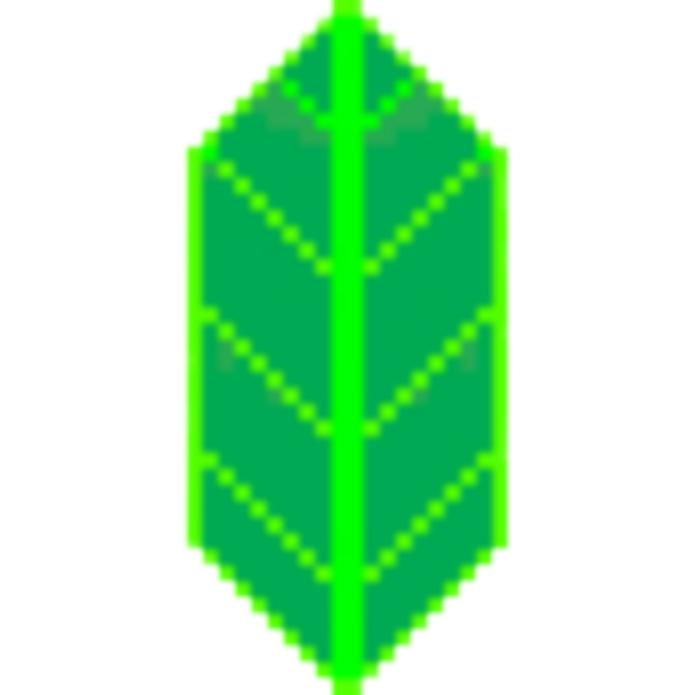
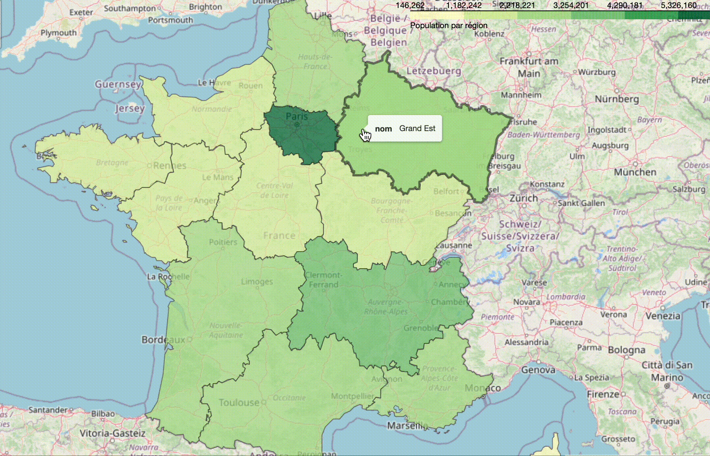

# Folium Tutorial 

 

# Sommaire
> ### [1. Qu'est ce que Folium ](#1)
> 
> > * [1.1 Documentation officielle](#11)
> > * [1.2 Créons notre première carte](#12)
> > * [1.3 Sauvegardons notre carte](#13)
>
> ### [2. Découverte des fonctionnalités](#2)
>
> > * [2.1 Types de cartes](#21)
> > * [2.2 Intégrer une mini carte dans la map](#22)
> > * [2.3 Les marqueurs : à partir d'un point](#23)
> > * [2.4 Les marqueurs : à partir d'une adresse](#24)
> > * [2.5 Les marqueurs : à partir d'un DataFrame](#25)
> 
> ### [3. Afficher des lignes](#3)
> 
> > * [3.1 Afficher des flux](#31)
> > * [3.2 Dessiner sur une carte](#32)
> 
> ### [4. Cartographier par zone](#4)
>     
> > * [4.1 Les GeoJson](#41)
> > * [4.2 Les cartes choroplèthes](#42)
> > * [4.3 Les cartes superposées (overlay)](#43)
> > * [4.4 Les Heat Map](#44)
> 
> 
> ### [5. Pour aller plus loin : Les Maps intéractives](#5)
